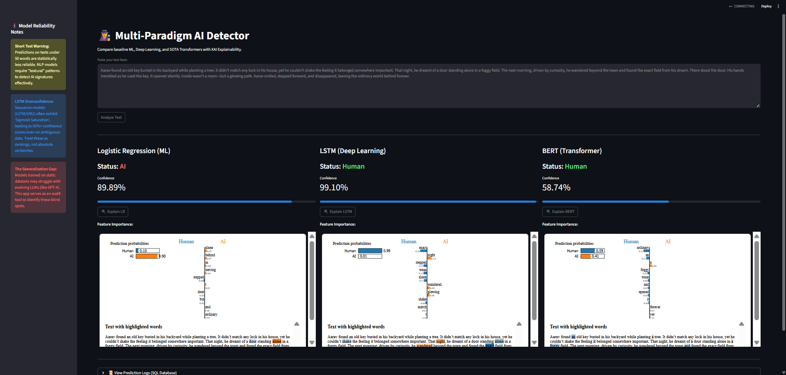

# 🕵️‍♂️ Read Between the Lines: A Multi-Paradigm AI Detector

[](https://www.python.org)
[](https://pytorch.org)
[](https://fastapi.tiangolo.com)
[](https://opensource.org/licenses/MIT)

**Empirical Research & Full-Stack MLOps Pipeline** : Can we truly distinguish between human thought and algorithmic generation? This project is a forensic audit of AI detection, comparing four architectural paradigms—from simple linear math to 1.5B parameter Transformers—to identify the "Generalization Gap" in modern NLP.



---

## 📖 Project Quick Links
* 📄 **[Technical Whitepaper](./Empirical_Study_AI_Text_Detection_2026.pdf):** Full research methodology and findings.
* 🚀 [**Live Demo**](https://read-between-the-lines-rkpzkgwffh8qdz5tlq4uqv.streamlit.app/): Test your own text against our models.
* 📂 **[Research Notebooks](./research):** Step-by-step development from Baseline to XAI.

---

## 📊 The Performance Matrix
We don't just optimize for accuracy; we optimize for **Deployment Viability**. 

| Paradigm | Architecture | Test Acc | F1-Score | Latency | Size |
| :--- | :--- | :--- | :--- | :--- | :--- |
| **Baseline ML** | TF-IDF + Logistic Regression | 82.5% | 0.825 | **<1ms** | **0.15 MB** |
| **Deep Learning** | PyTorch LSTM (Post-Padded) | 90.3% | 0.901 | ~1.1ms | 10.2 MB |
| **SOTA NLP** | BERT-Base-Uncased | **94.4%** | **0.944** | ~8.0ms | 440 MB |
| **LLM-as-a-Judge**| Qwen 1.5B (Zero-Shot) | 38.0% | N/A | High | >3 GB |

**Key Insight:** Generalized LLMs (Qwen/Phi) performing zero-shot were outperformed by a **0.15 MB Logistic Regression model**. This highlights that massive parameter counts do not inherently grant forensic detection capabilities without fine-tuning.

---

## 🧠 Technical Deep Dive: Engineering Challenges

### 1. The "Memory Wash-out" Fix (LSTM Preprocessing)
During the DL phase, we encountered a 20% accuracy drop. Investigation revealed that **Pre-padding** was causing the LSTM's hidden state to "wash out" before reaching the meaningful tokens. 
* **The Solution:** Implemented a custom **Post-padding** pipeline to preserve the model's sequential memory.
* **The Result:** Accuracy stabilized from 71% back to **90.3%**.

### 2. The Generalization Gap (Transformer Audit)
Despite BERT’s 94% accuracy, we identified a "Generalization Gap." BERT overfitted to the static distribution of the training set and struggled with the "human-like jitter" of modern RLHF-aligned models (GPT-4). This led to our recommendation of a **Hybrid Cascade Architecture** for production systems.

### 3. Opening the Black Box (XAI)
Using **LIME (Local Interpretable Model-Agnostic Explanations)**, we audited the models to see *why* they flagged text. We discovered the **"LSTM God Complex"**—where sequence models output 95%+ confidence based on structural purity rather than semantic content.

---

## 🛠️ MLOps & Production Stack
This isn't just a model; it's an integrated system:
* **Backend:** `FastAPI` for high-performance inference.
* **Frontend:** `Streamlit` dashboard for real-time multi-model comparison.
* **Data Layer:** `SQLite` logging for tracking model drift and user query history.
* **Scalability:** Custom `Mini-Batching` logic to prevent CUDA OOM (Out of Memory) errors on consumer-grade GPUs.

---

## 🚀 Installation & Usage

**1. Clone & Environment**
```bash
git clone [https://github.com/23f2001127/read-between-the-lines.git](https://github.com/23f2001127/read-between-the-lines.git)
cd read-between-the-lines
python -m venv venv
source venv/bin/activate  # venv\Scripts\activate on Windows
pip install -r requirements.txt
```

**2. Launch Services**
```bash
# Terminal 1: Start API
uvicorn app.backend.main:app --reload

# Terminal 2: Start UI
streamlit run app.frontend/app.py
```

---

## 📜 Research Paper Abstract
*"Our findings reveal that while BERT achieved the highest test accuracy, generalized LLMs performed worse than simple baseline models. This project bridges the gap between research and production by deploying a multi-paradigm audit tool that evaluates models on three critical axes: Accuracy, Latency, and Explainability."* — **[Read the Full Paper](./Empirical_Study_AI_Text_Detection_2026.pdf)**

---
**Author:** Antareep Ghosh  
**Focus:** AI Safety | NLP | MLOps  
*Prepared as part of an independent research initiative into the forensic detection of synthetic media.*